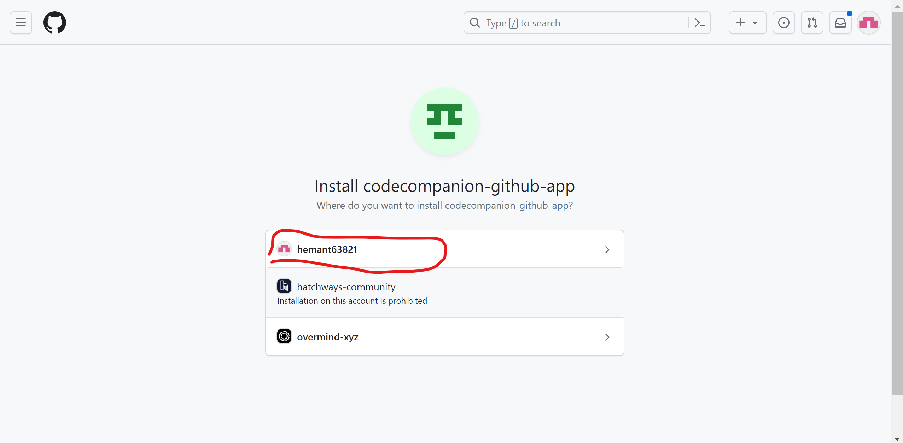

# ai-codecompanion-github-app

> A GitHub App built with [Probot](https://github.com/probot/probot) that a probot github open ai code guider app

## Setup

```sh
# Install dependencies
npm install

# Build the bot
npm run build

# Run the bot
npm start
```

## Docker

```sh
# 1. Build container
docker build -t ai-codecompanion-github-app .

# 2. Start container
docker run -e APP_ID=<app-id> -e PRIVATE_KEY=<pem-value> ai-codecompanion-github-app
```

## License

[ISC](LICENSE) © 2024 hemant.gogoi

## Important Setup

`` follow the below images to setup and register the ai-companion-app on your github repo.

`` Once setup you would notice .env file automatically created in your local project.

`` Once setup add below keys to your .env file

    1. # open ai apikey
        OPENAI_API_KEY=
    2. # BOT settings
        MODEL=
        PROMPT=Below there is a code diff please help me do a code review.

`` you could refer the above from env.sample

`` restart your server stop and npm start

## Reference Images


## Step 2


## Step 3



## Step 4


## Step 5


